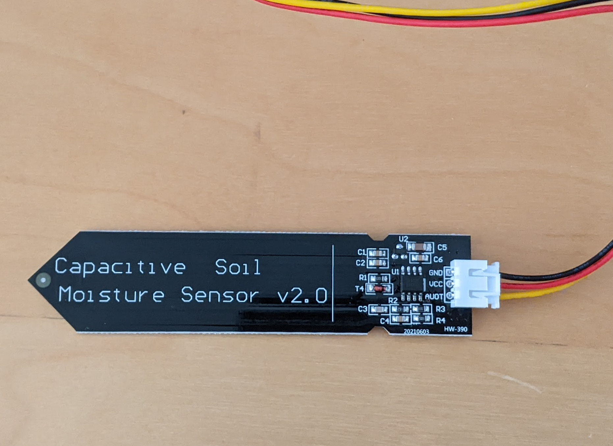
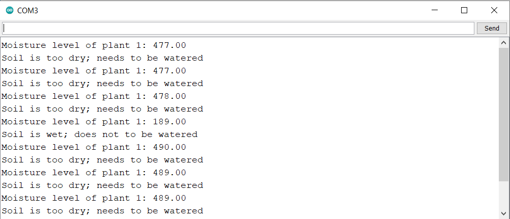
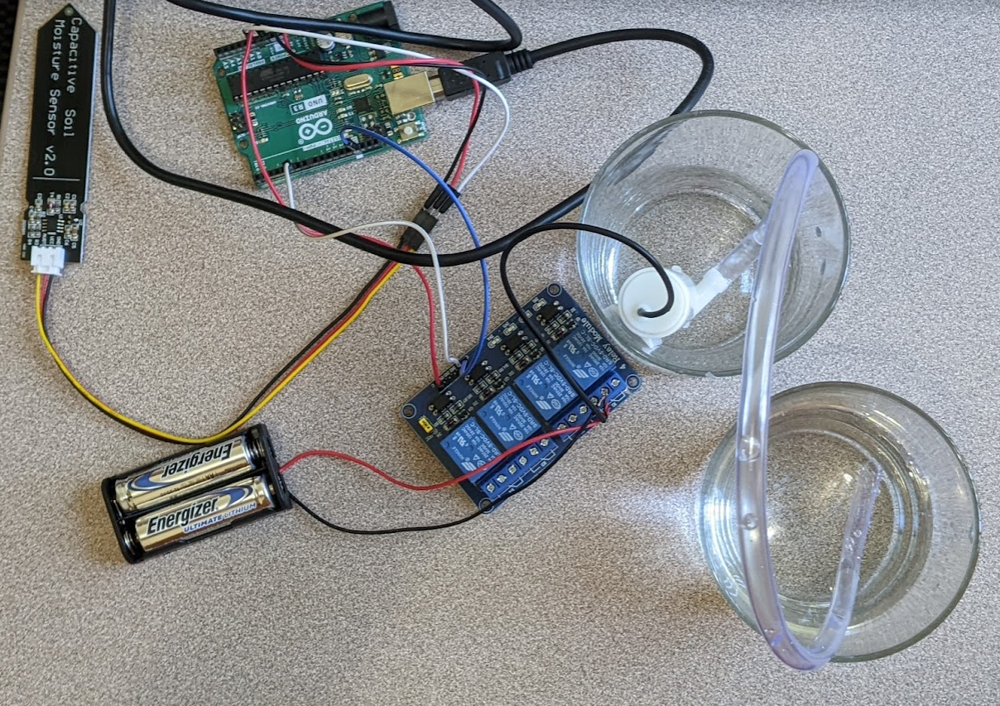

# Plant-Irrigation-System

# Proposal
## Project Significance:
Indoor plants not only enliven the room, but are also known to improve quality of air. Unfortunately, people sometimes forget to water their plants due 
to busy schedules. My automatic watering system will help plant owners by doing all the work for them! A moisture sensor is placed in the plant’s soil 
and once it detects that the soil is too dry, the device will water the plant until the moisture level is normal again. Instead of remembering when to 
water each plant, all a person needs are sensors in each of the plants’ soil and the vegetation health will be taken care of!

## Technical Description:
I will utilize the following parts:
* Arduino
* Soil moisture sensors
* Tubes
* 4 channel relays
* 2 water pumps
The 2 soil moisture sensors are connected to the arduino through the jumper wires (so they can reach to a plant). The arduino is connected to the 4 channel 
relay. The 4 channel relay is connected to the small water pumps and the batteries. Once the device is finished, the sensors will be inserted into the soil 
and if the soil is too dry, the water pumps will irrigate it. I will also include an LCD, that will diplay the last time the plant was watered and the current 
soil moisture level. For the second half of my project, I will add a second water pump and a moisture sensor, because if a plant is sitting in a large pot,
only the side that has the sensor will be watered. To encourage water to be equally distributed to the soil, I will include two sensors. Moreover, I will 
connect an LCD to the Arduino and display when was the last time the plant was watered, and the current soil moisture. My device will also detect if there is
enough water left in the tank. If not, it will send a signal to turn on the second water pump.

## Video Demos:
Part 1: https://youtu.be/mjuMYY3UxP0

# Project Steps:
First, I am testing one moisture sensor to make sure it works properly. 
Moisture sensors measure resistance, which varies based on the amount of water present in soil. Wet soil is much butter at conducting electricity than dry,
which means that wet soil has a lower resistance than dry soil (https://lastminuteengineers.com/soil-moisture-sensor-arduino-tutorial/). To test that the sensor is working correctly, I set a threshold of 460 in the code. When the reading is above 500, then the soil is too dry and the plant needs to be watered. Then, in the serial monitor, I display the results.

I first just lay the sensor on the table (the air is dry, so reading > 460) and then dip it in a cup of water to test (water reading is obviously < 460).

Second, I am adding the water pump and connect a tube to it, so the water can reach my plant!

### Sources I referenced:
The first three are for the general project structure, parts, and code guidance
* https://youtu.be/nUHizmtyt74 
* https://youtu.be/JdvnfENodak
* https://www.youtube.com/watch?v=BFLPmhYbRfY 

The next ones are for the second part of the project; helped me with LCD interfacing and moisture calcuations:
* https://create.arduino.cc/projecthub/Dynamic_Innovator/make-your-own-soil-moisture-sensor-with-arduino-9b3b89
* https://youtu.be/l4GPRTsuHkI

